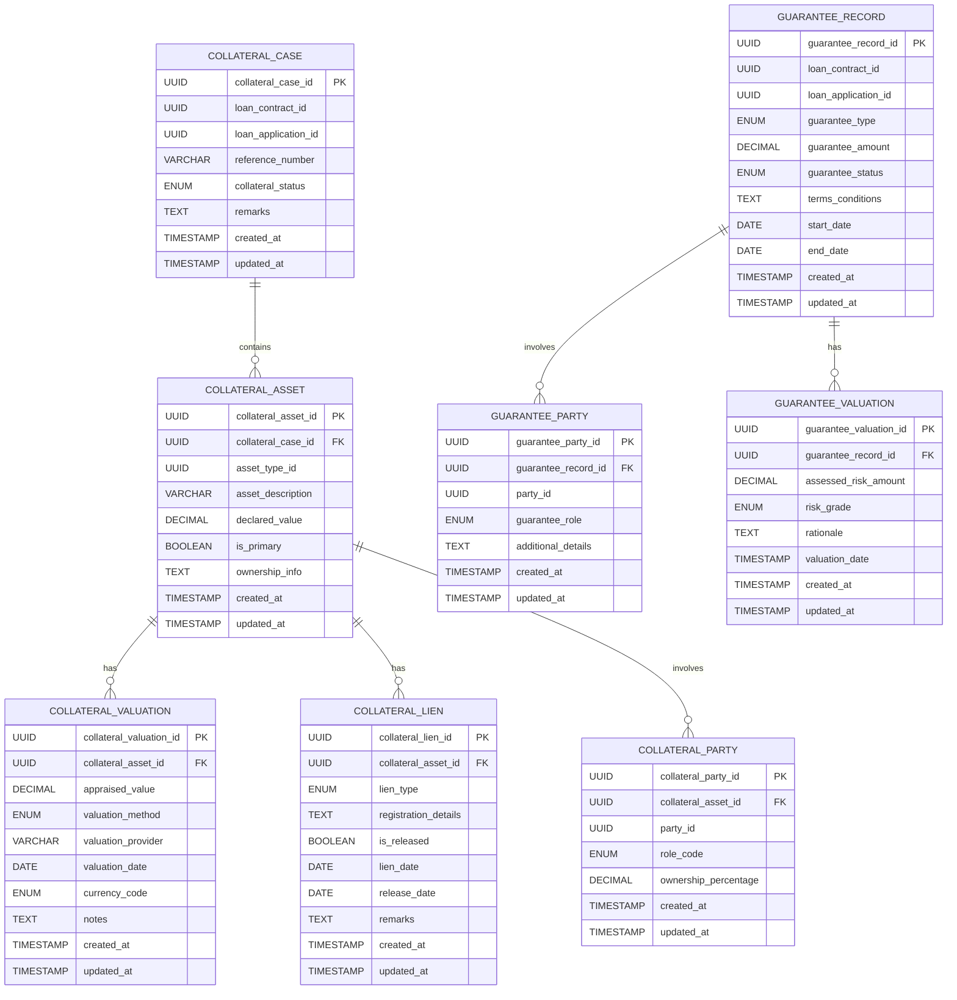

# Core Lending Collateral Management

A reactive microservice component of the **Firefly OpenCore Banking Platform** that manages collateral assets and guarantees for lending operations.

---

## Overview

The **Core Lending Collateral Management** microservice is a critical component of the Firefly OpenCore Banking Platform developed by **Firefly Software Solutions Inc** under the **Apache 2.0 license**. This service provides comprehensive management of collateral assets, cases, liens, valuations, and guarantees associated with loan contracts and applications.

**Organization**: [firefly-oss](https://github.com/firefly-oss)  
**Website**: [getfirefly.io](https://getfirefly.io)  
**License**: Apache 2.0

## Architecture

This microservice follows a **reactive, multi-module Maven architecture** with clear separation of concerns:

### Module Structure
- **`core-lending-collateral-management-interfaces`**: API contracts, DTOs, and enums
- **`core-lending-collateral-management-models`**: Database entities, repositories, and migrations
- **`core-lending-collateral-management-core`**: Business logic and service implementations
- **`core-lending-collateral-management-web`**: REST controllers and web configuration
- **`core-lending-collateral-management-sdk`**: OpenAPI specifications and client SDKs

### Layered Architecture
- **Web Layer**: Reactive REST controllers using Spring WebFlux
- **Service Layer**: Business logic with reactive programming patterns
- **Repository Layer**: R2DBC-based reactive data access
- **Database Layer**: PostgreSQL with Flyway migrations

## Core Features

### 🏦 Collateral Management
- **Collateral Cases**: Manage collateral cases linked to loan contracts and applications
- **Collateral Assets**: Track various asset types (real estate, vehicles, equipment, financial, other)
- **Collateral Liens**: Handle mortgage, pledge, hypothec, and other lien types
- **Collateral Parties**: Manage ownership relationships (owner, co-owner, occupant, custodian)
- **Collateral Valuations**: Support multiple valuation methods and currency codes

### 🛡️ Guarantee Management
- **Guarantee Records**: Handle personal, corporate, standby letter, and bank guarantees
- **Guarantee Parties**: Manage guarantor, beneficiary, and agent relationships
- **Guarantee Valuations**: Risk assessment with low/medium/high risk grades

## Technology Stack

| Component | Technology |
|-----------|------------|
| **Language** | Java 21 |
| **Framework** | Spring Boot 3.x |
| **Web Framework** | Spring WebFlux (Reactive) |
| **Database** | PostgreSQL |
| **Data Access** | Spring Data R2DBC |
| **Migration** | Flyway |
| **Build Tool** | Maven |
| **Documentation** | OpenAPI 3.0 / Swagger UI |
| **Monitoring** | Spring Boot Actuator |
| **Containerization** | Docker |
| **CI/CD** | GitHub Actions |

## API Documentation

### Base Endpoints

#### Collateral Management
```
GET    /api/v1/collateral-cases                                    # List collateral cases
POST   /api/v1/collateral-cases                                    # Create collateral case
GET    /api/v1/collateral-cases/{id}                               # Get collateral case
PUT    /api/v1/collateral-cases/{id}                               # Update collateral case
DELETE /api/v1/collateral-cases/{id}                               # Delete collateral case

GET    /api/v1/collateral-cases/{caseId}/assets                    # List assets for case
POST   /api/v1/collateral-cases/{caseId}/assets                    # Create asset
GET    /api/v1/collateral-cases/{caseId}/assets/{assetId}          # Get asset
PUT    /api/v1/collateral-cases/{caseId}/assets/{assetId}          # Update asset
DELETE /api/v1/collateral-cases/{caseId}/assets/{assetId}          # Delete asset

GET    /api/v1/collateral-cases/{caseId}/assets/{assetId}/valuations    # List valuations
POST   /api/v1/collateral-cases/{caseId}/assets/{assetId}/valuations    # Create valuation
GET    /api/v1/collateral-cases/{caseId}/assets/{assetId}/valuations/{valuationId}  # Get valuation
PUT    /api/v1/collateral-cases/{caseId}/assets/{assetId}/valuations/{valuationId}  # Update valuation
DELETE /api/v1/collateral-cases/{caseId}/assets/{assetId}/valuations/{valuationId}  # Delete valuation
```

#### Guarantee Management
```
GET    /v1/api/guarantees                                          # List guarantee records
POST   /v1/api/guarantees                                          # Create guarantee record
GET    /v1/api/guarantees/{id}                                     # Get guarantee record
PUT    /v1/api/guarantees/{id}                                     # Update guarantee record
DELETE /v1/api/guarantees/{id}                                     # Delete guarantee record

GET    /v1/api/guarantees/{guaranteeId}/parties                    # List guarantee parties
POST   /v1/api/guarantees/{guaranteeId}/parties                    # Create guarantee party
GET    /v1/api/guarantees/{guaranteeId}/parties/{partyId}          # Get guarantee party
PUT    /v1/api/guarantees/{guaranteeId}/parties/{partyId}          # Update guarantee party
DELETE /v1/api/guarantees/{guaranteeId}/parties/{partyId}          # Delete guarantee party

GET    /v1/api/guarantees/{guaranteeId}/valuations                 # List guarantee valuations
POST   /v1/api/guarantees/{guaranteeId}/valuations                 # Create guarantee valuation
GET    /v1/api/guarantees/{guaranteeId}/valuations/{valuationId}   # Get guarantee valuation
PUT    /v1/api/guarantees/{guaranteeId}/valuations/{valuationId}   # Update guarantee valuation
DELETE /v1/api/guarantees/{guaranteeId}/valuations/{valuationId}   # Delete guarantee valuation
```

### Interactive Documentation
- **Swagger UI**: Available at `/swagger-ui.html` when running
- **OpenAPI Spec**: Available at `/v3/api-docs`

## Quick Start

### Prerequisites
- Java 21+
- Maven 3.8+
- PostgreSQL 12+
- Docker (optional)

### Environment Variables
```bash
DB_HOST=localhost
DB_PORT=5432
DB_NAME=collateral_management
DB_USERNAME=your_username
DB_PASSWORD=your_password
DB_SSL_MODE=disable
SERVER_PORT=8080
```

### Local Development
```bash
# Clone the repository
git clone https://github.com/firefly-oss/core-lending-collateral-management.git
cd core-lending-collateral-management

# Build the application
mvn clean install

# Run the application
mvn spring-boot:run -pl core-lending-collateral-management-web
```

### Docker Deployment
```bash
# Build the application
mvn clean package

# Build Docker image
docker build -t core-lending-collateral-management .

# Run with Docker
docker run -p 8080:8080 \
  -e DB_HOST=your_db_host \
  -e DB_USERNAME=your_username \
  -e DB_PASSWORD=your_password \
  core-lending-collateral-management
```

## Project Structure

```
core-lending-collateral-management/
├── core-lending-collateral-management-interfaces/  # API contracts & DTOs
├── core-lending-collateral-management-models/      # Entities & repositories
├── core-lending-collateral-management-core/        # Business logic
├── core-lending-collateral-management-web/         # REST controllers
├── core-lending-collateral-management-sdk/         # OpenAPI specs
├── .github/workflows/                              # CI/CD pipelines
├── Dockerfile                                      # Container configuration
└── pom.xml                                         # Maven parent POM
```

## Data Model

The service manages two primary domains with the following entities:

### Collateral Domain
- **CollateralCase**: Root entity for collateral management
- **CollateralAsset**: Individual assets within a case
- **CollateralValuation**: Asset valuations and appraisals
- **CollateralLien**: Legal claims on assets
- **CollateralParty**: Parties associated with assets

### Guarantee Domain
- **GuaranteeRecord**: Root entity for guarantee management
- **GuaranteeParty**: Parties involved in guarantees
- **GuaranteeValuation**: Risk assessments and valuations

All entities use **UUID** primary keys and include audit fields (`created_at`, `updated_at`).

## Entity Relationship Diagram



## Enumerations

### Collateral Enums
- **CollateralStatus**: `ACTIVE`, `RELEASED`, `UNDER_REVIEW`, `PENDING`
- **AssetType**: `REAL_ESTATE`, `VEHICLE`, `EQUIPMENT`, `FINANCIAL`, `OTHER`
- **ValuationMethod**: `MARKET_COMPARISON`, `INCOME_APPROACH`, `COST_APPROACH`, `OTHER`
- **CurrencyCode**: `EUR`, `USD`, `GBP`
- **LienType**: `MORTGAGE`, `PLEDGE`, `HYPOTHEC`, `OTHER`
- **CollateralPartyRole**: `OWNER`, `CO_OWNER`, `OCCUPANT`, `CUSTODIAN`

### Guarantee Enums
- **GuaranteeType**: `PERSONAL`, `CORPORATE`, `STANDBY_LETTER`, `BANK_GUARANTEE`
- **GuaranteeStatus**: `ACTIVE`, `EXPIRED`, `TERMINATED`, `PENDING`
- **GuaranteeRole**: `GUARANTOR`, `BENEFICIARY`, `AGENT`
- **GuaranteeRiskGrade**: `LOW`, `MEDIUM`, `HIGH`

## Monitoring & Observability

The service includes comprehensive monitoring capabilities:

### Health Checks
- **Liveness Probe**: `/actuator/health/liveness`
- **Readiness Probe**: `/actuator/health/readiness`
- **General Health**: `/actuator/health`

### Metrics
- **Prometheus Metrics**: `/actuator/prometheus`
- **Application Info**: `/actuator/info`

### Configuration
```yaml
management:
  endpoints:
    web:
      exposure:
        include: health,info,prometheus
  endpoint:
    health:
      show-details: always
      probes:
        enabled: true
```

## Testing

### Running Tests
```bash
# Run all tests
mvn test

# Run tests with coverage
mvn test jacoco:report

# Run integration tests
mvn verify
```

### Test Structure
- **Unit Tests**: Service layer and business logic testing
- **Integration Tests**: Database and API endpoint testing
- **Contract Tests**: API contract validation

## Deployment

### CI/CD Pipeline
The service uses **GitHub Actions** for automated CI/CD:

1. **Build**: Compile and package the application
2. **Test**: Run unit and integration tests
3. **Security Scan**: Vulnerability assessment
4. **Docker Build**: Create container image
5. **Registry Push**: Push to Azure Container Registry
6. **Deploy**: Deploy to target environments

### Environment Configuration
```yaml
# Development
spring:
  profiles:
    active: dev
  r2dbc:
    url: r2dbc:postgresql://localhost:5432/collateral_dev

# Production
spring:
  profiles:
    active: prod
  r2dbc:
    url: r2dbc:postgresql://prod-db:5432/collateral_prod
```

## Development Guidelines

### Adding New Features
1. **Define DTOs** in the `interfaces` module with proper validation annotations
2. **Create Entities** in the `models` module with R2DBC annotations
3. **Implement Services** in the `core` module with reactive patterns
4. **Create Controllers** in the `web` module with OpenAPI documentation
5. **Write Tests** for all layers
6. **Update Documentation** including this README and OpenAPI specs

### Code Standards
- **Java 21** features and syntax
- **Reactive Programming** with Project Reactor
- **Validation** using Jakarta Bean Validation
- **Documentation** with OpenAPI 3.0 annotations
- **Testing** with JUnit 5 and Testcontainers

### Database Migrations
Use Flyway for database schema changes:
```sql
-- V{version}__{description}.sql
-- Example: V6__Add_New_Collateral_Field.sql
ALTER TABLE collateral_asset ADD COLUMN new_field VARCHAR(100);
```

## Contributing

We welcome contributions to the Firefly OpenCore Banking Platform!

### Getting Started
1. Fork the repository
2. Create a feature branch: `git checkout -b feature/your-feature-name`
3. Make your changes following our coding standards
4. Write tests for your changes
5. Ensure all tests pass: `mvn test`
6. Submit a pull request

### Pull Request Guidelines
- **Clear Description**: Explain what your changes do and why
- **Tests**: Include appropriate test coverage
- **Documentation**: Update relevant documentation
- **Conventional Commits**: Use conventional commit messages
- **Code Review**: Address feedback promptly

### Issue Reporting
- Use GitHub Issues for bug reports and feature requests
- Provide detailed reproduction steps for bugs
- Include relevant logs and error messages

## License

This project is licensed under the **Apache License 2.0**. See the [LICENSE](LICENSE) file for details.

## Support

- **Documentation**: [getfirefly.io](https://getfirefly.io)
- **Issues**: [GitHub Issues](https://github.com/firefly-oss/core-lending-collateral-management/issues)
- **Community**: [GitHub Discussions](https://github.com/firefly-oss/core-lending-collateral-management/discussions)

---

**Firefly OpenCore Banking Platform** - Building the future of open banking infrastructure.
