<div align="center">

# Core Lending Collateral Management

### Part of the Firefly OpenCore Banking Platform

[](https://opensource.org/licenses/Apache-2.0)
[](https://openjdk.org/projects/jdk/25/)
[](https://spring.io/projects/spring-boot)
[](https://www.postgresql.org/)

A reactive microservice for comprehensive collateral and guarantee management in lending operations.

[Features](#-features) • [Architecture](#-architecture) • [Quick Start](#-quick-start) • [API Documentation](#-api-documentation) • [Data Model](#-data-model)

</div>

---

## Table of Contents

- [Overview](#-overview)
- [Features](#-features)
- [Architecture](#-architecture)
  - [Module Structure](#module-structure)
  - [Layered Architecture](#layered-architecture)
  - [Technology Stack](#technology-stack)
- [Data Model](#-data-model)
  - [Entity Overview](#entity-overview)
  - [Entity Relationship Diagram](#entity-relationship-diagram)
  - [Detailed Entity Specifications](#detailed-entity-specifications)
  - [Enumerations](#enumerations)
- [API Documentation](#-api-documentation)
  - [Collateral Management Endpoints](#collateral-management-endpoints)
  - [Guarantee Management Endpoints](#guarantee-management-endpoints)
  - [Interactive Documentation](#interactive-documentation)
- [Quick Start](#-quick-start)
  - [Prerequisites](#prerequisites)
  - [Environment Variables](#environment-variables)
  - [Local Development](#local-development)
  - [Docker Deployment](#docker-deployment)
- [Development](#-development)
  - [Project Structure](#project-structure)
  - [Adding New Features](#adding-new-features)
  - [Code Standards](#code-standards)
  - [Database Migrations](#database-migrations)
- [Testing](#-testing)
- [Deployment](#-deployment)
- [Monitoring & Observability](#-monitoring--observability)
- [Contributing](#-contributing)
- [License](#-license)
- [Support](#-support)

---

## Overview

The **Core Lending Collateral Management** microservice is a critical component of the **Firefly OpenCore Banking Platform**, developed by **Firefly Software Solutions Inc** under the **Apache 2.0 license**. This service provides comprehensive management of collateral assets, cases, liens, valuations, insurance, monitoring, and guarantees associated with loan applications and servicing.

**Organization**: [firefly-oss](https://github.com/firefly-oss)
**Website**: [getfirefly.io](https://getfirefly.io)
**License**: Apache 2.0

### Key Capabilities

- **Complete Collateral Lifecycle Management** - From registration to release
- **Multi-Asset Type Support** - Real estate, vehicles, securities, equipment, and more
- **Comprehensive Valuation System** - Multiple methods, currencies, and detailed appraisals
- **Lien Management** - Track mortgages, pledges, hypothecs, and other legal claims
- **Insurance Tracking** - Monitor insurance policies and coverage
- **Guarantee Management** - Personal, corporate, and bank guarantees
- **Document Management** - Integration with ECM for document storage
- **Reactive Architecture** - High-performance, non-blocking operations
- **Full REST API** - OpenAPI 3.0 documented endpoints

---

## Features

### Collateral Management

#### Collateral Cases
- Manage collateral cases linked to loan applications and servicing cases
- Track collateral status (Active, Released, Under Review, Pending)
- Reference number generation and tracking
- Audit trail with creation and update timestamps

#### Collateral Assets
- Support for multiple asset types:
  - **Real Estate** - Residential, commercial, industrial, agricultural, land
  - **Vehicles** - Cars, trucks, motorcycles, boats, aircraft, heavy equipment
  - **Securities** - Stocks, bonds, mutual funds, ETFs, certificates of deposit
  - **Equipment** - Machinery, tools, technology, furniture
  - **Other** - Inventory, accounts receivable, intellectual property
- Asset identification and description
- Declared value tracking
- Primary asset designation
- Ownership information

#### Collateral Valuations
- Multiple valuation methods:
  - Market Comparison Approach
  - Income Approach
  - Cost Approach
  - Other specialized methods
- Comprehensive appraisal details:
  - Market value, rental value, replacement cost
  - Land value, building value, salvage value
  - Appraiser information and licensing
  - Methodology, assumptions, and limitations
  - Repair requirements and costs
- Multi-currency support (EUR, USD, GBP)
- Valuation expiry tracking

#### Collateral Liens
- Lien type management (Mortgage, Pledge, Hypothec, Other)
- Registration details tracking
- Release status and dates
- Lien priority and remarks

#### Collateral Parties
- Party role management (Owner, Co-Owner, Occupant, Custodian)
- Ownership percentage tracking
- Party relationship to assets

#### Collateral Documents
- Document type classification
- ECM integration for document storage
- Document metadata and versioning
- Expiry date tracking

#### Collateral Monitoring
- Periodic monitoring schedules
- Monitoring frequency (Daily, Weekly, Monthly, Quarterly, Annually)
- Findings and recommendations tracking
- Next monitoring date scheduling

#### Collateral Insurance
- Insurance type tracking (Property, Liability, Comprehensive, Other)
- Coverage amount and policy details
- Policy number and provider information
- Start and end date tracking
- Premium amount recording

### Guarantee Management

#### Guarantee Records
- Guarantee type support:
  - Personal Guarantee
  - Corporate Guarantee
  - Standby Letter of Credit
  - Bank Guarantee
- Guarantee amount and status tracking
- Terms and conditions documentation
- Start and end date management

#### Guarantee Parties
- Party role management (Guarantor, Beneficiary, Agent)
- Additional party details
- Relationship tracking

#### Guarantee Valuations
- Risk assessment and grading (Low, Medium, High)
- Assessed risk amount
- Valuation rationale and methodology
- Periodic revaluation tracking

#### Guarantee Documents
- Document classification and storage
- ECM integration
- Document expiry tracking

#### Guarantee Claims
- Claim reference and tracking
- Claimed, approved, and paid amounts
- Claim status management (Submitted, Under Review, Approved, Rejected, Paid, Partially Paid, Withdrawn)
- Claim reason documentation
- Supporting documentation links
- Settlement details

### Asset-Specific Details

#### Vehicle Collateral
- Vehicle type, make, model, year
- VIN (Vehicle Identification Number)
- License plate and registration
- Mileage tracking
- Color and condition
- Purchase price and date

#### Securities Collateral
- Security type (Stock, Bond, Mutual Fund, ETF, Certificate of Deposit, Other)
- ISIN, ticker symbol, CUSIP
- Quantity and unit price
- Market value tracking
- Issuer information
- Maturity date (for bonds)

#### Real Estate Property
- Property type (Residential, Commercial, Industrial, Agricultural, Land, Mixed Use)
- Complete address information
- Land and building area
- Number of units/rooms/floors
- Year built and condition
- Property use (Owner Occupied, Rental, Vacant, Commercial, Mixed)
- Zoning information
- Tax assessment value

---

## Architecture

This microservice follows a **reactive, multi-module Maven architecture** with clear separation of concerns and adherence to clean architecture principles.

### Module Structure

```
core-lending-collateral-management/
├── core-lending-collateral-management-interfaces/  # API contracts & DTOs
│   ├── dtos/                                       # Data Transfer Objects
│   └── enums/                                      # Enumerations
├── core-lending-collateral-management-models/      # Entities & repositories
│   ├── entities/                                   # JPA/R2DBC entities
│   ├── repositories/                               # R2DBC repositories
│   └── resources/db/migration/                     # Flyway migrations
├── core-lending-collateral-management-core/        # Business logic
│   ├── services/                                   # Service interfaces
│   ├── services/impl/                              # Service implementations
│   └── mappers/                                    # MapStruct mappers
├── core-lending-collateral-management-web/         # REST controllers
│   ├── controllers/                                # REST endpoints
│   └── resources/                                  # Application configuration
└── core-lending-collateral-management-sdk/         # OpenAPI specs & SDKs
```

### Layered Architecture

```
┌─────────────────────────────────────────────────────────────┐
│                      Web Layer (REST)                        │
│  Controllers with OpenAPI annotations, validation, filters   │
└─────────────────────────────────────────────────────────────┘
                            ↓
┌─────────────────────────────────────────────────────────────┐
│                     Service Layer                            │
│  Business logic, reactive operations (Mono/Flux)             │
└─────────────────────────────────────────────────────────────┘
                            ↓
┌─────────────────────────────────────────────────────────────┐
│                    Mapping Layer                             │
│  MapStruct entity-DTO bidirectional mapping                  │
└─────────────────────────────────────────────────────────────┘
                            ↓
┌─────────────────────────────────────────────────────────────┐
│                  Repository Layer                            │
│  R2DBC reactive data access, filtering, pagination           │
└─────────────────────────────────────────────────────────────┘
                            ↓
┌─────────────────────────────────────────────────────────────┐
│                   Database Layer                             │
│  PostgreSQL with Flyway migrations, enum types               │
└─────────────────────────────────────────────────────────────┘
```

### Technology Stack

| Component | Technology | Version |
|-----------|------------|---------|
| **Language** | Java | 21 |
| **Framework** | Spring Boot | 3.x |
| **Web Framework** | Spring WebFlux | Reactive |
| **Database** | PostgreSQL | 12+ |
| **Data Access** | Spring Data R2DBC | Reactive |
| **Migration** | Flyway | Latest |
| **Build Tool** | Maven | 3.8+ |
| **Mapping** | MapStruct | Latest |
| **Validation** | Jakarta Bean Validation | 3.0 |
| **Documentation** | OpenAPI 3.0 / Swagger UI | Latest |
| **Monitoring** | Spring Boot Actuator | Latest |
| **Containerization** | Docker | Latest |
| **CI/CD** | GitHub Actions | Latest |

---

## Data Model

### Entity Overview

The microservice manages **16 core entities** organized into two primary domains:

#### Collateral Domain (13 entities)
1. **CollateralCase** - Root entity for collateral management
2. **CollateralAsset** - Individual assets within a case
3. **CollateralValuation** - Asset valuations and appraisals
4. **CollateralLien** - Legal claims on assets
5. **CollateralParty** - Parties associated with assets
6. **CollateralDocument** - Documents related to collateral
7. **CollateralMonitoring** - Periodic monitoring records
8. **CollateralInsurance** - Insurance policies for assets
9. **VehicleCollateral** - Vehicle-specific details
10. **SecuritiesCollateral** - Securities-specific details
11. **RealEstateProperty** - Real estate-specific details

#### Guarantee Domain (5 entities)
12. **GuaranteeRecord** - Root entity for guarantee management
13. **GuaranteeParty** - Parties involved in guarantees
14. **GuaranteeValuation** - Risk assessments and valuations
15. **GuaranteeDocument** - Documents related to guarantees
16. **GuaranteeClaim** - Claims against guarantees

### Integration with Loan Lifecycle

Both `CollateralCase` and `GuaranteeRecord` entities track relationships across the loan lifecycle:
- **loan_application_id**: Links to the loan application (origination phase) - **required field**
- **loan_servicing_case_id**: Links to the loan servicing case (servicing phase) - **nullable field** populated when the loan enters servicing

The loan contract relationship is managed in the loan servicing microservice, eliminating redundancy and maintaining a clean separation of concerns. This design enables seamless tracking of collateral and guarantees from loan origination through servicing and beyond.

### Entity Relationship Diagram

```mermaid
erDiagram
    COLLATERAL_CASE ||--o{ COLLATERAL_ASSET : "contains"
    COLLATERAL_CASE ||--o{ COLLATERAL_DOCUMENT : "has"

    COLLATERAL_ASSET ||--o{ COLLATERAL_VALUATION : "has"
    COLLATERAL_ASSET ||--o{ COLLATERAL_LIEN : "has"
    COLLATERAL_ASSET ||--o{ COLLATERAL_PARTY : "involves"
    COLLATERAL_ASSET ||--o{ COLLATERAL_INSURANCE : "has"
    COLLATERAL_ASSET ||--o{ COLLATERAL_MONITORING : "has"
    COLLATERAL_ASSET ||--o| VEHICLE_COLLATERAL : "details"
    COLLATERAL_ASSET ||--o| SECURITIES_COLLATERAL : "details"
    COLLATERAL_ASSET ||--o| REAL_ESTATE_PROPERTY : "details"

    GUARANTEE_RECORD ||--o{ GUARANTEE_PARTY : "involves"
    GUARANTEE_RECORD ||--o{ GUARANTEE_VALUATION : "has"
    GUARANTEE_RECORD ||--o{ GUARANTEE_DOCUMENT : "has"
    GUARANTEE_RECORD ||--o{ GUARANTEE_CLAIM : "has"

    COLLATERAL_CASE {
        UUID collateral_case_id PK
        UUID loan_application_id "NOT NULL"
        UUID loan_servicing_case_id "NULLABLE"
        VARCHAR reference_number "50"
        ENUM collateral_status "NOT NULL"
        TEXT remarks
        TIMESTAMP created_at
        TIMESTAMP updated_at
    }

    COLLATERAL_ASSET {
        UUID collateral_asset_id PK
        UUID collateral_case_id FK "NOT NULL"
        ENUM asset_type "NOT NULL"
        VARCHAR asset_description "255"
        VARCHAR asset_identifier "100"
        DECIMAL declared_value "18,2"
        BOOLEAN is_primary
        TEXT ownership_info
        TIMESTAMP created_at
        TIMESTAMP updated_at
    }

    COLLATERAL_VALUATION {
        UUID collateral_valuation_id PK
        UUID collateral_asset_id FK "NOT NULL"
        DECIMAL appraised_value "18,2"
        ENUM valuation_method
        VARCHAR valuation_provider "255"
        VARCHAR appraiser_name "255"
        VARCHAR appraiser_license "100"
        DATE valuation_date
        DATE expiry_date
        ENUM currency_code
        DECIMAL market_value "18,2"
        DECIMAL rental_value "18,2"
        DECIMAL replacement_cost "18,2"
        DECIMAL land_value "18,2"
        DECIMAL building_value "18,2"
        DECIMAL salvage_value "18,2"
        TEXT comparable_assets "JSON"
        TEXT methodology
        TEXT assumptions
        TEXT limitations
        BOOLEAN requires_repairs
        TEXT required_repairs
        DECIMAL repair_cost "18,2"
        TEXT notes
        TIMESTAMP created_at
        TIMESTAMP updated_at
    }

    COLLATERAL_LIEN {
        UUID collateral_lien_id PK
        UUID collateral_asset_id FK "NOT NULL"
        ENUM lien_type "NOT NULL"
        TEXT registration_details
        BOOLEAN is_released
        DATE lien_date
        DATE release_date
        TEXT remarks
        TIMESTAMP created_at
        TIMESTAMP updated_at
    }

    COLLATERAL_PARTY {
        UUID collateral_party_id PK
        UUID collateral_asset_id FK "NOT NULL"
        UUID party_id "NOT NULL"
        ENUM role_code "NOT NULL"
        DECIMAL ownership_percentage "5,2"
        TIMESTAMP created_at
        TIMESTAMP updated_at
    }

    COLLATERAL_DOCUMENT {
        UUID collateral_document_id PK
        UUID collateral_case_id FK "NOT NULL"
        UUID document_id "ECM Reference"
        ENUM document_type "NOT NULL"
        VARCHAR document_name "255"
        DATE document_date
        DATE expiry_date
        TEXT notes
        TIMESTAMP created_at
        TIMESTAMP updated_at
    }

    COLLATERAL_MONITORING {
        UUID collateral_monitoring_id PK
        UUID collateral_asset_id FK "NOT NULL"
        DATE monitoring_date "NOT NULL"
        DATE next_monitoring_date
        ENUM monitoring_frequency
        DECIMAL current_value "18,2"
        DECIMAL previous_value "18,2"
        DECIMAL value_change_percentage "18,2"
        VARCHAR condition_assessment "2000"
        VARCHAR insurance_status "50"
        DATE insurance_expiry_date
        VARCHAR compliance_status "50"
        TEXT issues_identified "JSON"
        VARCHAR action_required "2000"
        VARCHAR action_taken "2000"
        UUID monitored_by
        TEXT notes
        TIMESTAMP created_at
        TIMESTAMP updated_at
    }

    COLLATERAL_INSURANCE {
        UUID collateral_insurance_id PK
        UUID collateral_asset_id FK "NOT NULL"
        ENUM insurance_type "NOT NULL"
        VARCHAR policy_number "100"
        VARCHAR insurance_provider "255"
        DECIMAL coverage_amount "18,2"
        DECIMAL premium_amount "18,2"
        DATE start_date
        DATE end_date "NOT NULL"
        TEXT notes
        TIMESTAMP created_at
        TIMESTAMP updated_at
    }

    VEHICLE_COLLATERAL {
        UUID vehicle_collateral_id PK
        UUID collateral_asset_id FK "NOT NULL, UNIQUE"
        ENUM vehicle_type "NOT NULL"
        VARCHAR make "100"
        VARCHAR model "100"
        INTEGER year
        VARCHAR vin "50"
        VARCHAR license_plate "20"
        VARCHAR registration_number "50"
        INTEGER mileage
        VARCHAR color "50"
        VARCHAR condition "50"
        DECIMAL purchase_price "18,2"
        DATE purchase_date
        TEXT notes
        TIMESTAMP created_at
        TIMESTAMP updated_at
    }

    SECURITIES_COLLATERAL {
        UUID securities_collateral_id PK
        UUID collateral_asset_id FK "NOT NULL, UNIQUE"
        ENUM security_type "NOT NULL"
        VARCHAR isin "12"
        VARCHAR ticker_symbol "10"
        VARCHAR cusip "9"
        DECIMAL quantity "18,6"
        DECIMAL unit_price "18,2"
        DECIMAL market_value "18,2"
        VARCHAR issuer "255"
        DATE maturity_date
        TEXT notes
        TIMESTAMP created_at
        TIMESTAMP updated_at
    }

    REAL_ESTATE_PROPERTY {
        UUID real_estate_property_id PK
        UUID collateral_asset_id FK "NOT NULL, UNIQUE"
        ENUM property_type "NOT NULL"
        VARCHAR address_line1 "255"
        VARCHAR address_line2 "255"
        VARCHAR city "100"
        VARCHAR state_province "100"
        VARCHAR postal_code "20"
        VARCHAR country "100"
        DECIMAL land_area "18,2"
        DECIMAL building_area "18,2"
        INTEGER number_of_units
        INTEGER number_of_rooms
        INTEGER number_of_floors
        INTEGER year_built
        ENUM property_condition
        ENUM property_use
        VARCHAR zoning "100"
        DECIMAL tax_assessment_value "18,2"
        TEXT notes
        TIMESTAMP created_at
        TIMESTAMP updated_at
    }

    GUARANTEE_RECORD {
        UUID guarantee_record_id PK
        UUID loan_application_id "NOT NULL"
        UUID loan_servicing_case_id "NULLABLE"
        ENUM guarantee_type "NOT NULL"
        DECIMAL guarantee_amount "18,2"
        ENUM guarantee_status
        TEXT terms_conditions
        DATE start_date
        DATE end_date
        TIMESTAMP created_at
        TIMESTAMP updated_at
    }

    GUARANTEE_PARTY {
        UUID guarantee_party_id PK
        UUID guarantee_record_id FK "NOT NULL"
        UUID party_id "NOT NULL"
        ENUM guarantee_role "NOT NULL"
        TEXT additional_details
        TIMESTAMP created_at
        TIMESTAMP updated_at
    }

    GUARANTEE_VALUATION {
        UUID guarantee_valuation_id PK
        UUID guarantee_record_id FK "NOT NULL"
        DECIMAL assessed_risk_amount "18,2"
        ENUM risk_grade
        TEXT rationale
        TIMESTAMP valuation_date
        TIMESTAMP created_at
        TIMESTAMP updated_at
    }

    GUARANTEE_DOCUMENT {
        UUID guarantee_document_id PK
        UUID guarantee_record_id FK "NOT NULL"
        UUID document_id "ECM Reference"
        ENUM document_type "NOT NULL"
        VARCHAR document_name "255"
        DATE document_date
        DATE expiry_date
        TEXT notes
        TIMESTAMP created_at
        TIMESTAMP updated_at
    }

    GUARANTEE_CLAIM {
        UUID guarantee_claim_id PK
        UUID guarantee_record_id FK "NOT NULL"
        VARCHAR claim_reference "100"
        DATE claim_date "NOT NULL"
        DECIMAL claimed_amount "18,2"
        DECIMAL approved_amount "18,2"
        DECIMAL paid_amount "18,2"
        ENUM claim_status "NOT NULL"
        TEXT claim_reason
        TEXT supporting_documentation "JSON"
        DATE settlement_date
        TEXT settlement_details
        TIMESTAMP created_at
        TIMESTAMP updated_at
    }
```



### Detailed Entity Specifications

#### Core Entities

| Entity | Primary Key | Foreign Keys | Key Attributes | Constraints |
|--------|-------------|--------------|----------------|-------------|
| **CollateralCase** | collateral_case_id (UUID) | - | loan_application_id, collateral_status | loan_application_id NOT NULL |
| **CollateralAsset** | collateral_asset_id (UUID) | collateral_case_id | asset_type, declared_value | collateral_case_id NOT NULL |
| **CollateralValuation** | collateral_valuation_id (UUID) | collateral_asset_id | appraised_value, valuation_method | collateral_asset_id NOT NULL |
| **CollateralLien** | collateral_lien_id (UUID) | collateral_asset_id | lien_type, is_released | collateral_asset_id NOT NULL |
| **CollateralParty** | collateral_party_id (UUID) | collateral_asset_id, party_id | role_code, ownership_percentage | Both FKs NOT NULL |
| **CollateralDocument** | collateral_document_id (UUID) | collateral_case_id, document_id | document_type, document_name | collateral_case_id NOT NULL |
| **CollateralMonitoring** | collateral_monitoring_id (UUID) | collateral_asset_id | monitoring_date, current_value, compliance_status | collateral_asset_id NOT NULL |
| **CollateralInsurance** | collateral_insurance_id (UUID) | collateral_asset_id | insurance_type, coverage_amount | collateral_asset_id NOT NULL |
| **VehicleCollateral** | vehicle_collateral_id (UUID) | collateral_asset_id (UNIQUE) | vehicle_type, vin, make, model | collateral_asset_id UNIQUE |
| **SecuritiesCollateral** | securities_collateral_id (UUID) | collateral_asset_id (UNIQUE) | security_type, isin, quantity | collateral_asset_id UNIQUE |
| **RealEstateProperty** | real_estate_property_id (UUID) | collateral_asset_id (UNIQUE) | property_type, address, land_area | collateral_asset_id UNIQUE |
| **GuaranteeRecord** | guarantee_record_id (UUID) | - | loan_application_id, guarantee_type | loan_application_id NOT NULL |
| **GuaranteeParty** | guarantee_party_id (UUID) | guarantee_record_id, party_id | guarantee_role | Both FKs NOT NULL |
| **GuaranteeValuation** | guarantee_valuation_id (UUID) | guarantee_record_id | assessed_risk_amount, risk_grade | guarantee_record_id NOT NULL |
| **GuaranteeDocument** | guarantee_document_id (UUID) | guarantee_record_id, document_id | document_type, document_name | guarantee_record_id NOT NULL |
| **GuaranteeClaim** | guarantee_claim_id (UUID) | guarantee_record_id | claim_status, claimed_amount | guarantee_record_id NOT NULL |

### Enumerations

The microservice uses **19 enumerations** for type safety and data integrity:

#### Collateral Enumerations

| Enumeration | Values | Description |
|-------------|--------|-------------|
| **CollateralStatusEnum** | `ACTIVE`, `RELEASED`, `UNDER_REVIEW`, `PENDING` | Status of collateral case |
| **AssetTypeEnum** | `REAL_ESTATE`, `VEHICLE`, `SECURITIES`, `EQUIPMENT`, `INVENTORY`, `ACCOUNTS_RECEIVABLE`, `CASH_DEPOSIT`, `PRECIOUS_METALS`, `INTELLECTUAL_PROPERTY`, `OTHER` | Type of collateral asset |
| **ValuationMethodEnum** | `MARKET_COMPARISON`, `INCOME_APPROACH`, `COST_APPROACH`, `OTHER` | Valuation methodology |
| **CurrencyCodeEnum** | `EUR`, `USD`, `GBP` | Currency for monetary values |
| **LienTypeEnum** | `MORTGAGE`, `PLEDGE`, `HYPOTHEC`, `OTHER` | Type of legal claim |
| **CollateralPartyRoleEnum** | `OWNER`, `CO_OWNER`, `OCCUPANT`, `CUSTODIAN` | Party relationship to asset |
| **DocumentTypeEnum** | `TITLE_DEED`, `APPRAISAL_REPORT`, `INSURANCE_POLICY`, `REGISTRATION`, `INSPECTION_REPORT`, `LEGAL_OPINION`, `VALUATION_CERTIFICATE`, `LIEN_RELEASE`, `OTHER` | Document classification |
| **MonitoringFrequencyEnum** | `DAILY`, `WEEKLY`, `MONTHLY`, `QUARTERLY`, `ANNUALLY` | Monitoring schedule |
| **InsuranceTypeEnum** | `PROPERTY`, `LIABILITY`, `COMPREHENSIVE`, `OTHER` | Insurance policy type |
| **VehicleTypeEnum** | `CAR`, `TRUCK`, `MOTORCYCLE`, `BOAT`, `AIRCRAFT`, `HEAVY_EQUIPMENT`, `OTHER` | Vehicle classification |
| **SecurityTypeEnum** | `STOCK`, `BOND`, `MUTUAL_FUND`, `ETF`, `CERTIFICATE_OF_DEPOSIT`, `OTHER` | Securities classification |
| **PropertyTypeEnum** | `RESIDENTIAL`, `COMMERCIAL`, `INDUSTRIAL`, `AGRICULTURAL`, `LAND`, `MIXED_USE` | Real estate classification |
| **PropertyConditionEnum** | `EXCELLENT`, `GOOD`, `FAIR`, `POOR`, `UNDER_CONSTRUCTION` | Property condition |
| **PropertyUseEnum** | `OWNER_OCCUPIED`, `RENTAL`, `VACANT`, `COMMERCIAL`, `MIXED` | Property usage |

#### Guarantee Enumerations

| Enumeration | Values | Description |
|-------------|--------|-------------|
| **GuaranteeTypeEnum** | `PERSONAL`, `CORPORATE`, `STANDBY_LETTER`, `BANK_GUARANTEE` | Type of guarantee |
| **GuaranteeStatusEnum** | `ACTIVE`, `EXPIRED`, `TERMINATED`, `PENDING` | Status of guarantee |
| **GuaranteeRoleEnum** | `GUARANTOR`, `BENEFICIARY`, `AGENT` | Party role in guarantee |
| **GuaranteeRiskGradeEnum** | `LOW`, `MEDIUM`, `HIGH` | Risk assessment grade |
| **ClaimStatusEnum** | `SUBMITTED`, `UNDER_REVIEW`, `APPROVED`, `REJECTED`, `PAID`, `PARTIALLY_PAID`, `WITHDRAWN` | Claim processing status |

---

## API Documentation

The microservice exposes **80 REST endpoints** organized into **16 controllers**, all documented with OpenAPI 3.0 annotations.

### Collateral Management Endpoints

#### Collateral Cases
```http
GET    /api/v1/collateral-cases                    # List/search collateral cases
POST   /api/v1/collateral-cases                    # Create collateral case
GET    /api/v1/collateral-cases/{id}               # Get collateral case by ID
PUT    /api/v1/collateral-cases/{id}               # Update collateral case
DELETE /api/v1/collateral-cases/{id}               # Delete collateral case
```

#### Collateral Assets
```http
GET    /api/v1/collateral-cases/{caseId}/assets                    # List assets for case
POST   /api/v1/collateral-cases/{caseId}/assets                    # Create asset
GET    /api/v1/collateral-cases/{caseId}/assets/{assetId}          # Get asset
PUT    /api/v1/collateral-cases/{caseId}/assets/{assetId}          # Update asset
DELETE /api/v1/collateral-cases/{caseId}/assets/{assetId}          # Delete asset
```

#### Collateral Valuations
```http
GET    /api/v1/collateral-cases/{caseId}/assets/{assetId}/valuations                    # List valuations
POST   /api/v1/collateral-cases/{caseId}/assets/{assetId}/valuations                    # Create valuation
GET    /api/v1/collateral-cases/{caseId}/assets/{assetId}/valuations/{valuationId}      # Get valuation
PUT    /api/v1/collateral-cases/{caseId}/assets/{assetId}/valuations/{valuationId}      # Update valuation
DELETE /api/v1/collateral-cases/{caseId}/assets/{assetId}/valuations/{valuationId}      # Delete valuation
```

#### Collateral Liens
```http
GET    /api/v1/collateral-cases/{caseId}/assets/{assetId}/liens                    # List liens
POST   /api/v1/collateral-cases/{caseId}/assets/{assetId}/liens                    # Create lien
GET    /api/v1/collateral-cases/{caseId}/assets/{assetId}/liens/{lienId}           # Get lien
PUT    /api/v1/collateral-cases/{caseId}/assets/{assetId}/liens/{lienId}           # Update lien
DELETE /api/v1/collateral-cases/{caseId}/assets/{assetId}/liens/{lienId}           # Delete lien
```

#### Collateral Parties
```http
GET    /api/v1/collateral-cases/{caseId}/assets/{assetId}/parties                    # List parties
POST   /api/v1/collateral-cases/{caseId}/assets/{assetId}/parties                    # Create party
GET    /api/v1/collateral-cases/{caseId}/assets/{assetId}/parties/{partyId}          # Get party
PUT    /api/v1/collateral-cases/{caseId}/assets/{assetId}/parties/{partyId}          # Update party
DELETE /api/v1/collateral-cases/{caseId}/assets/{assetId}/parties/{partyId}          # Delete party
```

#### Collateral Documents
```http
GET    /api/v1/collateral-cases/{caseId}/documents                    # List documents
POST   /api/v1/collateral-cases/{caseId}/documents                    # Create document
GET    /api/v1/collateral-cases/{caseId}/documents/{documentId}       # Get document
PUT    /api/v1/collateral-cases/{caseId}/documents/{documentId}       # Update document
DELETE /api/v1/collateral-cases/{caseId}/documents/{documentId}       # Delete document
```

#### Collateral Monitoring
```http
GET    /api/v1/collateral-assets/{collateralAssetId}/monitoring                    # List monitoring records
POST   /api/v1/collateral-assets/{collateralAssetId}/monitoring                    # Create monitoring record
GET    /api/v1/collateral-assets/{collateralAssetId}/monitoring/{monitoringId}     # Get monitoring record
PUT    /api/v1/collateral-assets/{collateralAssetId}/monitoring/{monitoringId}     # Update monitoring record
DELETE /api/v1/collateral-assets/{collateralAssetId}/monitoring/{monitoringId}     # Delete monitoring record
```

#### Collateral Insurance
```http
GET    /api/v1/collateral-assets/{assetId}/insurance                    # List insurance policies
POST   /api/v1/collateral-assets/{assetId}/insurance                    # Create insurance policy
GET    /api/v1/collateral-assets/{assetId}/insurance/{insuranceId}      # Get insurance policy
PUT    /api/v1/collateral-assets/{assetId}/insurance/{insuranceId}      # Update insurance policy
DELETE /api/v1/collateral-assets/{assetId}/insurance/{insuranceId}      # Delete insurance policy
```

#### Vehicle Collateral Details
```http
GET    /api/v1/collateral-assets/{assetId}/vehicle-details                    # List vehicle details
POST   /api/v1/collateral-assets/{assetId}/vehicle-details                    # Create vehicle details
GET    /api/v1/collateral-assets/{assetId}/vehicle-details/{vehicleId}        # Get vehicle details
PUT    /api/v1/collateral-assets/{assetId}/vehicle-details/{vehicleId}        # Update vehicle details
DELETE /api/v1/collateral-assets/{assetId}/vehicle-details/{vehicleId}        # Delete vehicle details
```

#### Securities Collateral Details
```http
GET    /api/v1/collateral-assets/{assetId}/securities-details                    # List securities details
POST   /api/v1/collateral-assets/{assetId}/securities-details                    # Create securities details
GET    /api/v1/collateral-assets/{assetId}/securities-details/{securitiesId}     # Get securities details
PUT    /api/v1/collateral-assets/{assetId}/securities-details/{securitiesId}     # Update securities details
DELETE /api/v1/collateral-assets/{assetId}/securities-details/{securitiesId}     # Delete securities details
```

#### Real Estate Property Details
```http
GET    /api/v1/collateral-assets/{assetId}/property-details                    # List property details
POST   /api/v1/collateral-assets/{assetId}/property-details                    # Create property details
GET    /api/v1/collateral-assets/{assetId}/property-details/{propertyId}       # Get property details
PUT    /api/v1/collateral-assets/{assetId}/property-details/{propertyId}       # Update property details
DELETE /api/v1/collateral-assets/{assetId}/property-details/{propertyId}       # Delete property details
```

### Guarantee Management Endpoints

#### Guarantee Records
```http
GET    /api/v1/guarantees                    # List/search guarantee records
POST   /api/v1/guarantees                    # Create guarantee record
GET    /api/v1/guarantees/{id}               # Get guarantee record by ID
PUT    /api/v1/guarantees/{id}               # Update guarantee record
DELETE /api/v1/guarantees/{id}               # Delete guarantee record
```

#### Guarantee Parties
```http
GET    /api/v1/guarantees/{guaranteeId}/parties                    # List parties
POST   /api/v1/guarantees/{guaranteeId}/parties                    # Create party
GET    /api/v1/guarantees/{guaranteeId}/parties/{partyId}          # Get party
PUT    /api/v1/guarantees/{guaranteeId}/parties/{partyId}          # Update party
DELETE /api/v1/guarantees/{guaranteeId}/parties/{partyId}          # Delete party
```

#### Guarantee Valuations
```http
GET    /api/v1/guarantees/{guaranteeId}/valuations                    # List valuations
POST   /api/v1/guarantees/{guaranteeId}/valuations                    # Create valuation
GET    /api/v1/guarantees/{guaranteeId}/valuations/{valuationId}      # Get valuation
PUT    /api/v1/guarantees/{guaranteeId}/valuations/{valuationId}      # Update valuation
DELETE /api/v1/guarantees/{guaranteeId}/valuations/{valuationId}      # Delete valuation
```

#### Guarantee Documents
```http
GET    /api/v1/guarantee-records/{guaranteeId}/documents                    # List documents
POST   /api/v1/guarantee-records/{guaranteeId}/documents                    # Create document
GET    /api/v1/guarantee-records/{guaranteeId}/documents/{documentId}       # Get document
PUT    /api/v1/guarantee-records/{guaranteeId}/documents/{documentId}       # Update document
DELETE /api/v1/guarantee-records/{guaranteeId}/documents/{documentId}       # Delete document
```

#### Guarantee Claims
```http
GET    /api/v1/guarantee-records/{guaranteeId}/claims                    # List claims
POST   /api/v1/guarantee-records/{guaranteeId}/claims                    # Create claim
GET    /api/v1/guarantee-records/{guaranteeId}/claims/{claimId}          # Get claim
PUT    /api/v1/guarantee-records/{guaranteeId}/claims/{claimId}          # Update claim
DELETE /api/v1/guarantee-records/{guaranteeId}/claims/{claimId}          # Delete claim
```

### Interactive Documentation

- **Swagger UI**: Available at `/swagger-ui.html` when the application is running
- **OpenAPI Spec**: Available at `/v3/api-docs` in JSON format
- **OpenAPI YAML**: Available at `/v3/api-docs.yaml`

### Request/Response Features

- **Filtering**: All list endpoints support dynamic filtering via `FilterRequest`
- **Pagination**: Configurable page size and page number
- **Sorting**: Multi-field sorting support
- **Validation**: Jakarta Bean Validation on all request bodies
- **Error Handling**: Standardized error responses
- **Reactive Streams**: Non-blocking Mono/Flux responses

---

## Quick Start

### Prerequisites

- **Java 25+** - [Download](https://openjdk.org/projects/jdk/25/)
- **Maven 3.8+** - [Download](https://maven.apache.org/download.cgi)
- **PostgreSQL 12+** - [Download](https://www.postgresql.org/download/)
- **Docker** (optional) - [Download](https://www.docker.com/get-started)

### Environment Variables

```bash
# Database Configuration
DB_HOST=localhost
DB_PORT=5432
DB_NAME=collateral_management
DB_USERNAME=your_username
DB_PASSWORD=your_password
DB_SSL_MODE=disable

# Application Configuration
SERVER_PORT=8080
SPRING_PROFILES_ACTIVE=dev

# Logging
LOGGING_LEVEL_ROOT=INFO
LOGGING_LEVEL_COM_FIREFLY=DEBUG
```

### Local Development

```bash
# 1. Clone the repository
git clone https://github.com/firefly-oss/core-lending-collateral-management.git
cd core-lending-collateral-management

# 2. Set up PostgreSQL database
createdb collateral_management

# 3. Configure environment variables
export DB_HOST=localhost
export DB_PORT=5432
export DB_NAME=collateral_management
export DB_USERNAME=postgres
export DB_PASSWORD=your_password

# 4. Build the application
mvn clean install

# 5. Run the application
mvn spring-boot:run -pl core-lending-collateral-management-web

# 6. Access the application
# API: http://localhost:8080
# Swagger UI: http://localhost:8080/swagger-ui.html
# Health Check: http://localhost:8080/actuator/health
```

### Docker Deployment

```bash
# 1. Build the application
mvn clean package -DskipTests

# 2. Build Docker image
docker build -t firefly/core-lending-collateral-management:latest .

# 3. Run with Docker Compose (recommended)
docker-compose up -d

# OR run standalone
docker run -p 8080:8080 \
  -e DB_HOST=your_db_host \
  -e DB_PORT=5432 \
  -e DB_NAME=collateral_management \
  -e DB_USERNAME=your_username \
  -e DB_PASSWORD=your_password \
  firefly/core-lending-collateral-management:latest
```

### Docker Compose Example

```yaml
version: '3.8'

services:
  postgres:
    image: postgres:15-alpine
    environment:
      POSTGRES_DB: collateral_management
      POSTGRES_USER: firefly
      POSTGRES_PASSWORD: firefly123
    ports:
      - "5432:5432"
    volumes:
      - postgres_data:/var/lib/postgresql/data

  collateral-management:
    image: firefly/core-lending-collateral-management:latest
    depends_on:
      - postgres
    environment:
      DB_HOST: postgres
      DB_PORT: 5432
      DB_NAME: collateral_management
      DB_USERNAME: firefly
      DB_PASSWORD: firefly123
    ports:
      - "8080:8080"

volumes:
  postgres_data:
```

---

## Development

### Project Structure

```
core-lending-collateral-management/
├── core-lending-collateral-management-interfaces/
│   ├── src/main/java/.../interfaces/
│   │   ├── dtos/                    # 16 DTOs with validation
│   │   └── enums/                   # 19 enumerations
│   └── pom.xml
├── core-lending-collateral-management-models/
│   ├── src/main/java/.../models/
│   │   ├── entities/                # 16 R2DBC entities
│   │   └── repositories/            # 17 reactive repositories
│   ├── src/main/resources/db/migration/
│   │   ├── V1__Create_Enums.sql
│   │   ├── V2__Create_Tables.sql
│   │   ├── ...
│   │   └── V11__Convert_Property_And_Insurance_To_Enums.sql
│   └── pom.xml
├── core-lending-collateral-management-core/
│   ├── src/main/java/.../core/
│   │   ├── services/                # 16 service interfaces
│   │   ├── services/impl/           # 16 service implementations
│   │   └── mappers/                 # 16 MapStruct mappers
│   └── pom.xml
├── core-lending-collateral-management-web/
│   ├── src/main/java/.../web/
│   │   └── controllers/             # 16 REST controllers
│   ├── src/main/resources/
│   │   └── application.yml          # Application configuration
│   └── pom.xml
├── core-lending-collateral-management-sdk/
│   └── pom.xml
├── .github/workflows/
│   └── ci-cd.yml                    # GitHub Actions workflow
├── Dockerfile
├── docker-compose.yml
├── pom.xml                          # Parent POM
└── README.md
```

### Adding New Features

1. **Define DTOs** in the `interfaces` module
   - Add validation annotations (`@NotNull`, `@Size`, etc.)
   - Use `@FilterableId` for UUID fields that should be filterable
   - Document with JavaDoc

2. **Create Entities** in the `models` module
   - Use R2DBC annotations (`@Table`, `@Column`, `@Id`)
   - Follow naming conventions (snake_case for DB, camelCase for Java)
   - Add audit fields (`created_at`, `updated_at`)

3. **Create Database Migration** in `models/resources/db/migration`
   - Follow naming: `V{version}__{description}.sql`
   - Create enums before using them in tables
   - Add proper constraints and indexes

4. **Create Repository** in `models/repositories`
   - Extend `BaseRepository<Entity, UUID>`
   - Add custom query methods if needed

5. **Create Mapper** in `core/mappers`
   - Use MapStruct with `@Mapper(componentModel = "spring")`
   - Define `toEntity` and `toDTO` methods

6. **Create Service Interface** in `core/services`
   - Extend base CRUD operations
   - Add JavaDoc for all methods
   - Return `Mono<>` or `Flux<>` for reactive operations

7. **Implement Service** in `core/services/impl`
   - Implement business logic
   - Use reactive patterns
   - Handle errors appropriately

8. **Create Controller** in `web/controllers`
   - Add `@Tag` and `@Operation` annotations
   - Use `@Valid` for request body validation
   - Follow RESTful conventions
   - Return `Mono<ResponseEntity<>>`

9. **Write Tests**
   - Unit tests for services
   - Integration tests for repositories
   - API tests for controllers

10. **Update Documentation**
    - Update this README
    - Update OpenAPI specifications
    - Add inline code documentation

### Code Standards

#### Java Conventions
- **Java 25** features and syntax
- **Reactive Programming** with Project Reactor (Mono/Flux)
- **Immutability** where possible (use `@Builder`, `@Data`)
- **Null Safety** - use `Optional` or reactive types
- **Naming**: camelCase for variables/methods, PascalCase for classes

#### Validation
- Use **Jakarta Bean Validation** annotations
- Validate at DTO level, not entity level
- Provide meaningful validation messages

#### Documentation
- **JavaDoc** for all public methods in service interfaces
- **OpenAPI annotations** for all controller endpoints
- **Inline comments** for complex business logic

#### Testing
- **JUnit 5** for unit tests
- **Testcontainers** for integration tests
- **Minimum 80% code coverage**
- Test happy paths and error scenarios

### Database Migrations

Use **Flyway** for all database schema changes:

```sql
-- V12__Add_Collateral_Risk_Rating.sql
-- Add risk rating to collateral assets

ALTER TABLE collateral_asset
ADD COLUMN risk_rating VARCHAR(20);

COMMENT ON COLUMN collateral_asset.risk_rating IS 'Risk rating of the collateral asset';
```

**Migration Best Practices:**
- Never modify existing migrations
- Always increment version number
- Use descriptive names
- Add comments for complex changes
- Test migrations on a copy of production data
- Keep migrations idempotent where possible

---

## Testing

### Running Tests

```bash
# Run all tests
mvn test

# Run tests with coverage report
mvn test jacoco:report

# Run integration tests only
mvn verify -P integration-tests

# Run specific test class
mvn test -Dtest=CollateralCaseServiceTest

# Run tests in parallel
mvn test -T 4
```

### Test Coverage

The project maintains **high test coverage** across all layers:

| Layer | Coverage Target | Current |
|-------|----------------|---------|
| Controllers | 80%+ | |
| Services | 90%+ | |
| Repositories | 70%+ | |
| Mappers | 100% | |
| Overall | 85%+ | |

### Test Structure

```
src/test/java/
├── unit/
│   ├── services/          # Service layer unit tests
│   └── mappers/           # Mapper tests
├── integration/
│   ├── repositories/      # Repository integration tests
│   └── controllers/       # API integration tests
└── validation/
    └── dtos/              # DTO validation tests
```

---

## Deployment

### CI/CD Pipeline

The service uses **GitHub Actions** for automated CI/CD:

```yaml
Workflow Steps:
1. Checkout code
2. Set up Java 25
3. Cache Maven dependencies
4. Run tests
5. Build application
6. Security scan (OWASP, Snyk)
7. Build Docker image
8. Push to container registry
9. Deploy to environment
10. Run smoke tests
```

### Environment Configuration

#### Development
```yaml
spring:
  profiles:
    active: dev
  r2dbc:
    url: r2dbc:postgresql://localhost:5432/collateral_dev
    username: dev_user
    password: dev_password
  flyway:
    enabled: true
    baseline-on-migrate: true
logging:
  level:
    com.firefly: DEBUG
```

#### Staging
```yaml
spring:
  profiles:
    active: staging
  r2dbc:
    url: r2dbc:postgresql://staging-db:5432/collateral_staging
    username: ${DB_USERNAME}
    password: ${DB_PASSWORD}
    pool:
      initial-size: 10
      max-size: 50
logging:
  level:
    com.firefly: INFO
```

#### Production
```yaml
spring:
  profiles:
    active: prod
  r2dbc:
    url: r2dbc:postgresql://prod-db:5432/collateral_prod
    username: ${DB_USERNAME}
    password: ${DB_PASSWORD}
    pool:
      initial-size: 20
      max-size: 100
  flyway:
    enabled: true
    validate-on-migrate: true
logging:
  level:
    com.firefly: WARN
management:
  endpoints:
    web:
      exposure:
        include: health,info,prometheus
```

### Kubernetes Deployment

```yaml
apiVersion: apps/v1
kind: Deployment
metadata:
  name: collateral-management
spec:
  replicas: 3
  selector:
    matchLabels:
      app: collateral-management
  template:
    metadata:
      labels:
        app: collateral-management
    spec:
      containers:
      - name: collateral-management
        image: firefly/core-lending-collateral-management:latest
        ports:
        - containerPort: 8080
        env:
        - name: DB_HOST
          valueFrom:
            secretKeyRef:
              name: db-credentials
              key: host
        - name: DB_USERNAME
          valueFrom:
            secretKeyRef:
              name: db-credentials
              key: username
        - name: DB_PASSWORD
          valueFrom:
            secretKeyRef:
              name: db-credentials
              key: password
        livenessProbe:
          httpGet:
            path: /actuator/health/liveness
            port: 8080
          initialDelaySeconds: 30
          periodSeconds: 10
        readinessProbe:
          httpGet:
            path: /actuator/health/readiness
            port: 8080
          initialDelaySeconds: 20
          periodSeconds: 5
        resources:
          requests:
            memory: "512Mi"
            cpu: "500m"
          limits:
            memory: "2Gi"
            cpu: "2000m"
```

---

## Monitoring & Observability

The service includes comprehensive monitoring and observability features:

### Health Checks

```http
GET /actuator/health              # Overall health status
GET /actuator/health/liveness     # Kubernetes liveness probe
GET /actuator/health/readiness    # Kubernetes readiness probe
GET /actuator/health/db           # Database connectivity
```

**Response Example:**
```json
{
  "status": "UP",
  "components": {
    "db": {
      "status": "UP",
      "details": {
        "database": "PostgreSQL",
        "validationQuery": "isValid()"
      }
    },
    "diskSpace": {
      "status": "UP",
      "details": {
        "total": 499963174912,
        "free": 123456789012,
        "threshold": 10485760
      }
    }
  }
}
```

### Metrics

```http
GET /actuator/metrics                    # Available metrics
GET /actuator/metrics/{metric.name}      # Specific metric
GET /actuator/prometheus                 # Prometheus format
```

**Key Metrics:**
- `http.server.requests` - HTTP request metrics
- `jvm.memory.used` - JVM memory usage
- `jvm.gc.pause` - Garbage collection pauses
- `r2dbc.pool.acquired` - Database connection pool
- `process.cpu.usage` - CPU usage

### Logging

**Log Levels:**
- `ERROR` - Application errors
- `WARN` - Warning messages
- `INFO` - Informational messages
- `DEBUG` - Detailed debugging (dev/staging only)
- `TRACE` - Very detailed tracing (dev only)

**Log Format (JSON):**
```json
{
  "timestamp": "2025-11-02T10:30:45.123Z",
  "level": "INFO",
  "logger": "com.firefly.core.lending.collateral.core.services.impl.CollateralCaseServiceImpl",
  "message": "Created collateral case",
  "context": {
    "collateralCaseId": "123e4567-e89b-12d3-a456-426614174000",
    "loanApplicationId": "987fcdeb-51a2-43f7-b123-456789abcdef"
  }
}
```

### Distributed Tracing

Integration with **Spring Cloud Sleuth** and **Zipkin** for distributed tracing:

```yaml
spring:
  sleuth:
    sampler:
      probability: 1.0  # 100% sampling in dev, 10% in prod
  zipkin:
    base-url: http://zipkin-server:9411
```

### Alerting

**Recommended Alerts:**
- API response time > 2 seconds
- Error rate > 1%
- Database connection pool exhaustion
- Memory usage > 85%
- CPU usage > 80%
- Disk space < 10%

---

## Contributing

We welcome contributions to the **Firefly OpenCore Banking Platform**!

### Getting Started

1. **Fork the repository**
   ```bash
   # Click "Fork" on GitHub
   git clone https://github.com/YOUR_USERNAME/core-lending-collateral-management.git
   cd core-lending-collateral-management
   ```

2. **Create a feature branch**
   ```bash
   git checkout -b feature/your-feature-name
   # OR
   git checkout -b fix/your-bug-fix
   ```

3. **Make your changes**
   - Follow the code standards
   - Write tests
   - Update documentation

4. **Commit your changes**
   ```bash
   git add .
   git commit -m "feat: add new collateral monitoring feature"
   ```

5. **Push to your fork**
   ```bash
   git push origin feature/your-feature-name
   ```

6. **Create a Pull Request**
   - Go to the original repository
   - Click "New Pull Request"
   - Select your branch
   - Fill in the PR template

### Commit Message Convention

We follow **Conventional Commits**:

```
<type>(<scope>): <subject>

<body>

<footer>
```

**Types:**
- `feat`: New feature
- `fix`: Bug fix
- `docs`: Documentation changes
- `style`: Code style changes (formatting, etc.)
- `refactor`: Code refactoring
- `test`: Adding or updating tests
- `chore`: Maintenance tasks

**Examples:**
```
feat(collateral): add vehicle collateral tracking
fix(valuation): correct currency conversion calculation
docs(readme): update API documentation
test(services): add unit tests for guarantee service
```

### Pull Request Guidelines

**Required:**
- Clear description of changes
- Tests for new features/fixes
- Updated documentation
- All tests passing
- No merge conflicts
- Code review approval

**Avoid:**
- Large PRs (>500 lines changed)
- Mixing multiple features
- Breaking changes without discussion
- Incomplete features

### Code Review Process

1. **Automated Checks** - CI/CD pipeline runs
2. **Peer Review** - At least one approval required
3. **Maintainer Review** - Final approval from maintainer
4. **Merge** - Squash and merge to main branch

### Issue Reporting

**Bug Reports:**
```markdown
**Describe the bug**
A clear description of the bug.

**To Reproduce**
Steps to reproduce the behavior:
1. Call endpoint '...'
2. With payload '...'
3. See error

**Expected behavior**
What you expected to happen.

**Actual behavior**
What actually happened.

**Environment:**
- Version: [e.g., 1.0.0]
- Java Version: [e.g., 21]
- Database: [e.g., PostgreSQL 15]

**Additional context**
Logs, screenshots, etc.
```

**Feature Requests:**
```markdown
**Is your feature request related to a problem?**
A clear description of the problem.

**Describe the solution you'd like**
A clear description of what you want to happen.

**Describe alternatives you've considered**
Alternative solutions or features.

**Additional context**
Any other context or screenshots.
```

---

## License

This project is licensed under the **Apache License 2.0**.

```
Copyright 2025 Firefly Software Solutions Inc

Licensed under the Apache License, Version 2.0 (the "License");
you may not use this file except in compliance with the License.
You may obtain a copy of the License at

    http://www.apache.org/licenses/LICENSE-2.0

Unless required by applicable law or agreed to in writing, software
distributed under the License is distributed on an "AS IS" BASIS,
WITHOUT WARRANTIES OR CONDITIONS OF ANY KIND, either express or implied.
See the License for the specific language governing permissions and
limitations under the License.
```

See the [LICENSE](LICENSE) file for the full license text.

---

## Support

### Documentation
- **Website**: [getfirefly.io](https://getfirefly.io)
- **API Docs**: [Swagger UI](http://localhost:8080/swagger-ui.html) (when running locally)
- **Wiki**: [GitHub Wiki](https://github.com/firefly-oss/core-lending-collateral-management/wiki)

### Community
- **GitHub Issues**: [Report bugs or request features](https://github.com/firefly-oss/core-lending-collateral-management/issues)
- **GitHub Discussions**: [Ask questions and share ideas](https://github.com/firefly-oss/core-lending-collateral-management/discussions)
- **Stack Overflow**: Tag questions with `firefly-opencore`

### Commercial Support
For enterprise support, training, and consulting:
- **Email**: support@getfirefly.io
- **Website**: [getfirefly.io/support](https://getfirefly.io/support)

---

<div align="center">

### Star us on GitHub!

If you find this project useful, please consider giving it a star 

**Firefly OpenCore Banking Platform** - Building the future of open banking infrastructure.

[Website](https://getfirefly.io) • [Documentation](https://docs.getfirefly.io) • [GitHub](https://github.com/firefly-oss) • [Community](https://github.com/firefly-oss/core-lending-collateral-management/discussions)

---

Made with by the Firefly team and [contributors](https://github.com/firefly-oss/core-lending-collateral-management/graphs/contributors)

</div>
